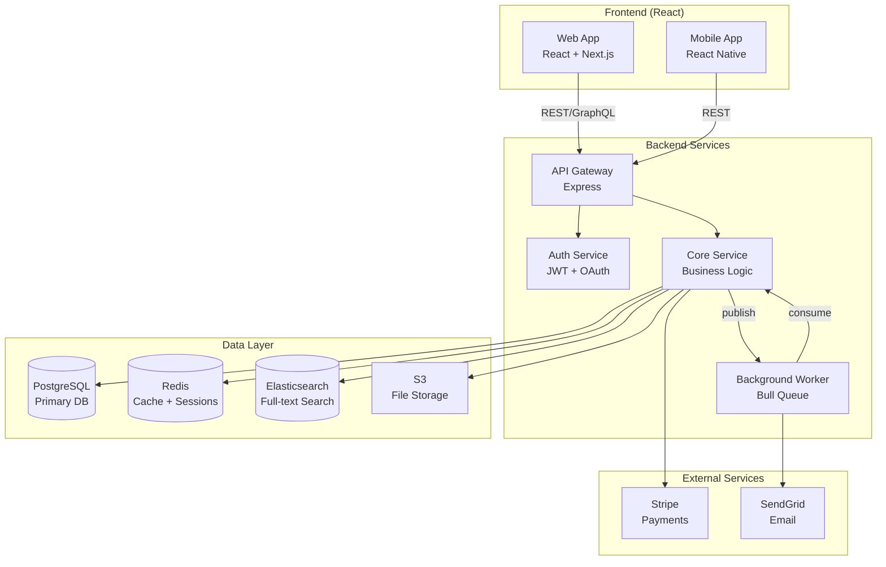
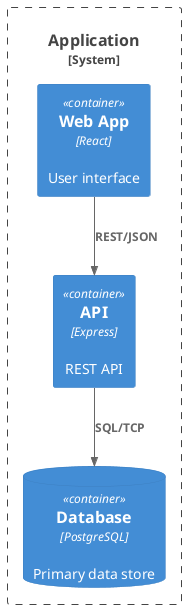

# Architecture Diagram

Generate visual architecture diagrams from codebase analysis.

## Process

### Step 0: Load Context
- Check `CLAUDE.md` for architecture documentation conventions
- Check `${CLAUDE_SKILL_DIR}/_config.json` for preferences
- Check for existing diagrams in `docs/`, `docs/architecture/`, or `README.md`

### Step 1: Parse Arguments
Parse `$ARGUMENTS`:
- First positional: diagram type (see types below)
- `--scope`: directory or module to focus on (default: entire project)
- `--format`: output format - "mermaid" (default) | "plantuml" | "d2"
- `--output`: output file path (default: `docs/architecture/<type>.md`)
- `--depth`: how many levels deep to analyze (default: auto based on project size)
- `--changed`: highlight recently changed modules (`git diff --name-only HEAD~10`)

**Diagram types:**

| Type | Description | Best For |
|---|---|---|
| `system` | High-level system overview | Onboarding, architecture reviews |
| `dependency` | Module/file dependency graph | Understanding coupling, circular deps |
| `data-flow` | Data flow through application | Debugging, feature tracing |
| `class` | Class/type/interface relationships | OOP codebases, domain modeling |
| `sequence` | Request lifecycle sequence | API debugging, integration design |
| `er` | Entity relationship from models | Database design, schema reviews |
| `api` | API endpoint map with methods | API overview, route planning |
| `c4` | C4 model (context/container/component) | Architecture documentation |
| `deployment` | Infrastructure and deployment | DevOps, cloud architecture |

### Step 2: Analyze Codebase

**For system diagrams:**
- Identify major layers: frontend, backend, database, external services, queues
- Map communication patterns: REST, GraphQL, WebSocket, gRPC, message queues
- Identify infrastructure: cache (Redis), CDN, object storage (S3), auth provider, search (Elasticsearch)
- Detect deployment boundaries: microservices, serverless, monolith
- Read Docker Compose, K8s manifests, or IaC for infrastructure hints

**For dependency diagrams:**
- Use `npx madge --image` or `npx depcruise` if available
- Otherwise, parse imports across all source files
- Build adjacency list of module → dependencies
- **Detect circular dependencies** and highlight them
- Calculate metrics: fan-in (dependents), fan-out (dependencies)
- Group by directory/feature/domain
- Filter out node_modules, test files, type-only imports

**For data-flow diagrams:**
- Trace data from user input → API → validation → service → database
- Map transformation points (DTOs, serializers, mappers)
- Identify side effects: emails, webhooks, queue publishing, logging, analytics
- Trace error paths and fallback flows
- Identify caching layers and invalidation points

**For class/type diagrams:**
- Extract classes, interfaces, types, enums, abstract classes
- Map inheritance (`extends`), implementation (`implements`), mixins
- Map composition (class fields referencing other types)
- Include key methods and properties (skip trivial getters/setters)
- Detect patterns: repository, factory, strategy, observer, decorator

**For sequence diagrams:**
- Trace a typical request through middleware → handler → service → database → response
- Include error/retry paths
- Show async operations (queue publish, webhook dispatch)
- Include auth flow if applicable
- Show parallel operations where they occur

**For ER diagrams:**
- Extract models from Prisma, Drizzle, TypeORM, Sequelize, Django, SQLAlchemy, Mongoose
- Map relationships: one-to-one, one-to-many, many-to-many (with junction tables)
- Include field names, types, constraints (unique, nullable, default)
- Identify indexes and composite keys
- Show soft deletes, timestamps, audit fields

**For API diagrams:**
- Extract all API endpoints from route definitions
- Group by resource/router/controller
- Show HTTP methods, paths, auth requirements, rate limits
- Indicate public vs. authenticated vs. admin endpoints
- Show request/response flow between services

**For C4 diagrams:**
- **Context**: system boundaries, users, external systems
- **Container**: applications, databases, message brokers, file stores
- **Component**: major components within each container
- Use C4-PlantUML or Mermaid C4 syntax

**For deployment diagrams:**
- Parse infrastructure files: Dockerfile, docker-compose.yml, K8s manifests, Terraform, CDK
- Map services to infrastructure (which container runs where)
- Show network boundaries, load balancers, DNS
- Include CI/CD pipeline flow if `.github/workflows/` exists

### Step 3: Generate Diagram

**Mermaid (default - renders in GitHub, VS Code, most markdown viewers):**


**PlantUML:**


**D2:**
```d2
frontend: Frontend {
  web: Web App
  mobile: Mobile App
}
backend: Backend {
  api: API Gateway
  auth: Auth Service
}
data: Data {
  db: PostgreSQL
  cache: Redis
}
frontend.web -> backend.api: REST
backend.api -> data.db: SQL
```

**Guidelines for readable diagrams:**
- Maximum 15-20 nodes per diagram (split into sub-diagrams if larger)
- Use subgraphs/groups for logical boundaries
- Use meaningful short labels with technology in secondary line
- Include edge labels for non-obvious connections (protocol, data type)
- Use consistent direction: TB for systems, LR for sequences/flows
- Color-code by concern: blue=frontend, green=backend, orange=data, gray=external
- Add legend if color-coding or symbols are used
- For large codebases, generate multiple focused diagrams rather than one massive one

### Step 4: Write Output
- Default: create `docs/architecture/<type>.md` with embedded diagram
- Include a brief text description above the diagram explaining what it shows
- Add diagram metadata:
  ```markdown
  > Generated from codebase analysis on YYYY-MM-DD
  > Scope: <directory or full project>
  > Nodes: N | Connections: N
  ```
- If updating existing diagram, show what changed

### Step 5: Report
```
## Architecture Diagram Generated

### Type: <diagram-type>
### Format: <mermaid|plantuml|d2>
### Output: docs/architecture/<type>.md

### Diagram Contents
| Metric | Count |
|---|---|
| Nodes | N |
| Connections | N |
| Subgroups | N |
| Depth | N levels |

### Insights Discovered
- Circular dependency: A → B → C → A (should be broken)
- High fan-in: Module X has N dependents (stable core module)
- High fan-out: Module Y depends on N modules (potential god module)
- Orphan modules: N files with no dependents (possibly dead code)
- Missing error boundary: N routes without error handling layer

### Viewing Options
| Viewer | How |
|---|---|
| GitHub | Renders automatically in .md files |
| VS Code | Markdown Preview or Mermaid extension |
| Online | Paste into mermaid.live / plantuml.com |
| PDF | Use `npx mmdc -i diagram.mmd -o diagram.pdf` |

### Follow-up
- Run `/genskills:dead-code` to investigate orphan modules
- Run `/genskills:refactor` to address high-coupling modules
- Run `/genskills:readme-gen` to embed diagram in project README
```

## Configuration
Check `${CLAUDE_SKILL_DIR}/_config.json` for user preferences:
- `format`: "mermaid" | "plantuml" | "d2" - diagram format (default: "mermaid")
- `outputDir`: string - output directory (default: "docs/architecture")
- `maxNodes`: number - max nodes before splitting diagram (default: 20)
- `includeTests`: boolean - include test files in dependency graphs (default: false)
- `includeTypes`: boolean - include type-only imports in dependency graphs (default: false)
- `theme`: "default" | "dark" | "forest" | "neutral" - Mermaid theme (default: "default")
- `direction`: "TB" | "LR" | "BT" | "RL" - graph direction (default: auto per type)
